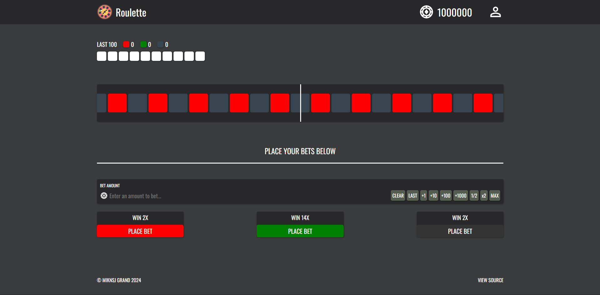

# Roulette

## Overview
The casino game featuring a wheel of numbers where you have to predict where the ball will land.

## Video
Check out a video of the website [here](https://www.youtube.com/watch?v=Sgs9wJHx90s).

## Screenshots


## Description
View the website [here](https://miknsj.github.io/roulette).

## Notes
Unlike previous websites that I have built, this will be mostly created using JavaScript only.

<br>

Also, the responsive/adaptive design will not be fully enforced. This means that the website may not render properly on
smaller devices. For the BEST viewing purposes, I recommend loading the website on a device with at least the screen
size of 1300px.

## Contents
- ```assets```: contains images displayed on the website
- ```README.md```: contains description of the repository
- ```index.html```: main html file
- ```styles.css```: main css file
- ```script.js```: main javascript file

## Contributions
Tools

- WSL2 (Ubuntu 11.4.0)
- Vim + coc.nvim
- npm + live-server

<br>

Assets

Since assets are constantly being updated, please refer to the ```assets``` folder
to find out more.

## Changelog
- Website Version 1.0 established on August 2024

## License
Established on August 2024 by MIKNSJ.
